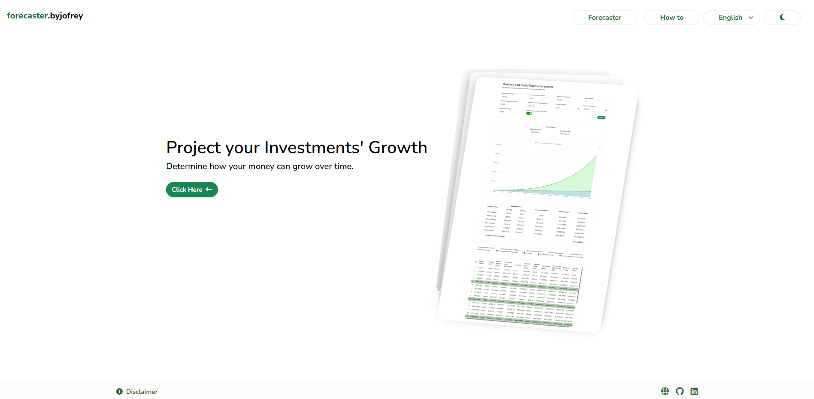
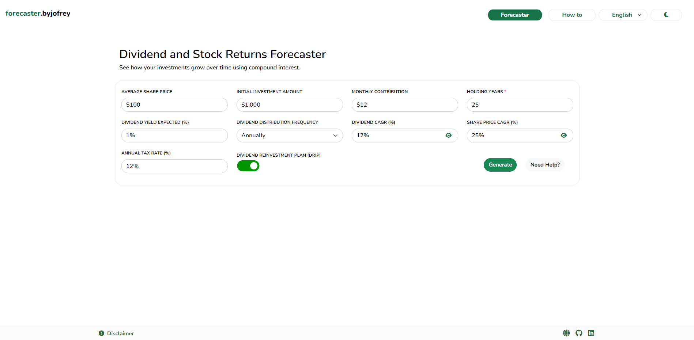
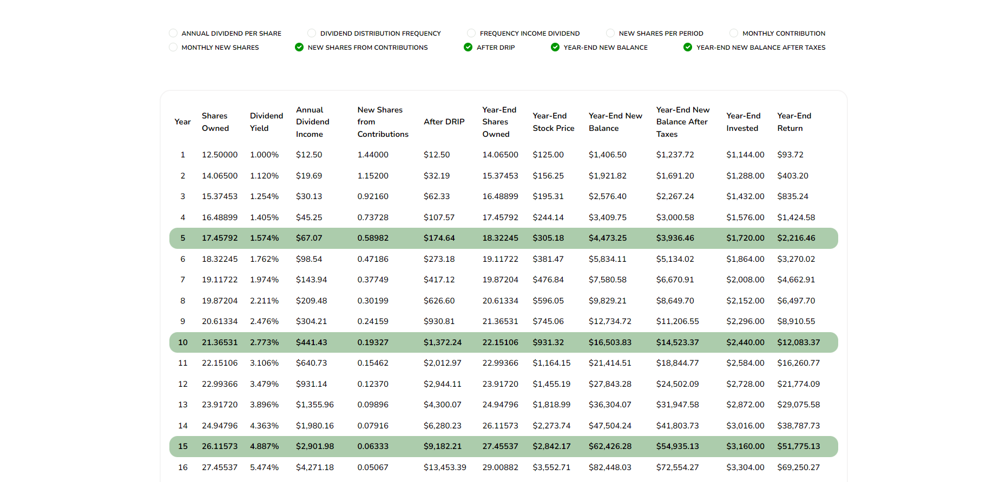
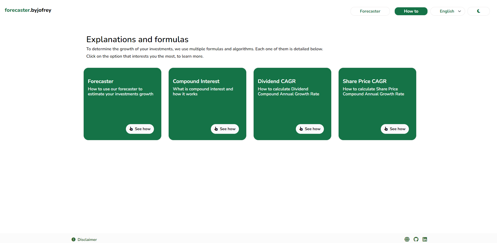

 # INVESTMENT FORECASTER

 ## English (EN)

 ### Introduction
 **Investment Forecaster** is a professional-grade Angular 18 web application designed to help investors visualize and project the long-term growth of their stock market investments. It allows you to simulate how your portfolio can evolve over time considering dividend reinvestments, compound growth rates, and various other factors. With automatic language detection (English/Spanish) based on user location, it offers a tailored user experience globally.

 ### What the Application Does
 - **Forecast Investment Growth Over Time:** Input your initial investment, monthly contributions, expected dividend yield, holding period, dividend CAGR, and share price CAGR to estimate how your portfolio might grow.
 - **Interactive Charts & Detailed Tables:** Get visual insights into portfolio evolution through dynamic charts and comprehensive data tables.
 - **Dividend Reinvestment (DRIP):** Understand how reinvesting dividends can significantly increase your overall returns.
 - **CAGR Calculations:** Learn and calculate the Compound Annual Growth Rate for dividends and share prices.
 - **Internationalization (i18n):** Automatic detection of user location to switch between English and Spanish interfaces.
 - **Educational Content:** Access detailed explanations on compound interest, dividend CAGR, share price CAGR, and how to effectively use the forecaster tool.
 - **Mathematical Formulas with KaTeX:** Key financial formulas (like CAGR) are rendered neatly for better readability and understanding.

 ### Technologies & Requirements
 - **Framework & Language:** Angular 18, TypeScript
 - **UI & Styling:** Bootstrap 5.3.3, @angular/material 18.1.0
 - **Charts & Visualization:** echarts 5.5.1, ngx-echarts 18.0.0
 - **Utilities:** ngx-mask 17.1.1 (for input formatting), ngx-spinner 17.0.0 (loading indicators)
 - **Icons & Math:** @fortawesome/fontawesome-free 6.5.2 for icons, katex 0.16.11 for formula rendering
 - **Node.js 20 Required:** Please ensure Node.js version 20 or above is installed.
 - **Internationalization:** Built-in Angular i18n, combined with external tools (XLIFF Tools) for automatic translation of `.xlf` files.

 ### System Sections (with Reference Images)
 Below are the main sections of the system, each accompanied by a reference image placeholder. 

 1. **Home Page / Landing Page**  
    Introduces the concept of projecting investment growth and invites the user to start exploring.  
    

 2. **Forecaster (Calculator) Page**  
    The core of the application. Users enter parameters like initial investment, monthly contributions, dividend yield, holding years, dividend CAGR, and share price CAGR. The app then generates growth projections.  
    

 3. **Results (Charts & Tables)**  
    After inputting data and clicking "Generate," view the results as interactive charts showing portfolio growth over time and tables detailing annual dividends, reinvestments, and returns.  
    
     

 5. **Explanations and Formulas (How to)**  
    A dedicated section that provides explanations of key financial concepts and formulas. It features several subsections for deeper learning.  
    


 ### Cloning and Running Locally
 1. **Clone the Repository:**
    ```bash
    git clone https://github.com/Jofreylin/PORTFOLIO_FORECAST.git
    ```

 2. **Navigate into the Project Directory:**
    ```bash
    cd PORTFOLIO_FORECAST
    ```

 3. **Install Dependencies:**
    ```bash
    npm install
    ```

 4. **Start the Development Server:**
    ```bash
    ng serve
    ```
    Access the application at:
    ```
    http://localhost:4200
    ```

 ### Disclaimer
 The information provided by this application is for general informational purposes only. It does not constitute financial advice or investment recommendations. Calculations are based on historical data and assumptions, and do not guarantee future results. Consult a qualified financial advisor before making any investment decisions. Use the application at your own risk; the developers are not responsible for any losses or damages.

 ### License
 Released under the **MIT License**.

 **Owner / Author:** Jofreylin P.

 ---

 ## Español (ES)

 ### Introducción
 **Investment Forecaster** es una aplicación web profesional desarrollada con Angular 18, pensada para ayudar a los inversores a proyectar el crecimiento de sus portafolios en la bolsa de valores. Permite simular la evolución de tus inversiones a lo largo del tiempo considerando la reinversión de dividendos, tasas de crecimiento compuestas y otros factores clave. Además, detecta el idioma automáticamente (inglés/español) basándose en la ubicación del usuario.

 ### Qué Permite Hacer la Aplicación
 - **Proyección del Crecimiento de Inversiones:** Ingresa inversión inicial, aportes mensuales, rendimiento por dividendos, años de tenencia, CAGR de dividendos y precio de la acción para estimar cómo crecerá tu portafolio.
 - **Gráficos Interactivos y Tablas Detalladas:** Observa la evolución de tu portafolio mediante gráficas dinámicas y tablas con datos precisos.
 - **Reinversión de Dividendos (DRIP):** Comprende cómo la reinversión de dividendos puede aumentar significativamente tus retornos.
 - **Cálculo de CAGR:** Aprende y calcula la Tasa de Crecimiento Anual Compuesta tanto para dividendos como para el precio de las acciones.
 - **Internacionalización (i18n):** Cambio automático entre inglés y español según tu ubicación.
 - **Contenido Educativo:** Accede a explicaciones sobre interés compuesto, CAGR de dividendos, CAGR del precio de las acciones y aprende a usar efectivamente la herramienta de proyección.
 - **Fórmulas Matemáticas con KaTeX:** Las fórmulas financieras clave (como el CAGR) se muestran claramente para una mejor comprensión.

 ### Tecnologías & Requisitos
 - **Framework & Lenguaje:** Angular 18, TypeScript
 - **UI & Estilos:** Bootstrap 5.3.3, @angular/material 18.1.0
 - **Gráficos:** echarts 5.5.1, ngx-echarts 18.0.0
 - **Utilidades:** ngx-mask 17.1.1 (enmascarado de inputs), ngx-spinner 17.0.0 (spinners de carga)
 - **Íconos & Matemáticas:** @fortawesome/fontawesome-free 6.5.2, katex 0.16.11
 - **Node.js 20 Requerido:** Asegúrate de tener Node.js 20 o superior instalado.
 - **Internacionalización:** i18n de Angular, con herramientas externas (XLIFF Tools) para la traducción automática de archivos `.xlf`.


 ### Clonar y Ejecutar Localmente
 1. **Clonar el Repositorio:**
    ```bash
    git clone https://github.com/Jofreylin/PORTFOLIO_FORECAST.git
    ```

 2. **Entrar al Directorio del Proyecto:**
    ```bash
    cd PORTFOLIO_FORECAST
    ```

 3. **Instalar Dependencias:**
    ```bash
    npm install
    ```

 4. **Iniciar el Servidor de Desarrollo:**
    ```bash
    ng serve
    ```
    Accede a la aplicación en:
    ```
    http://localhost:4200
    ```

 ### Aviso Legal (Disclaimer)
 La información proporcionada por esta aplicación es solo con fines informativos generales. No constituye asesoramiento financiero ni recomendaciones de inversión. Los cálculos se basan en datos históricos y suposiciones, y no garantizan resultados futuros. Consulte con un asesor financiero calificado antes de tomar cualquier decisión de inversión. El uso de esta herramienta es bajo su propio riesgo; los desarrolladores no se hacen responsables por pérdidas o daños.

 ### Licencia
 Publicado bajo la **Licencia MIT**.

 **Propietario / Autor:** Jofreylin P.
